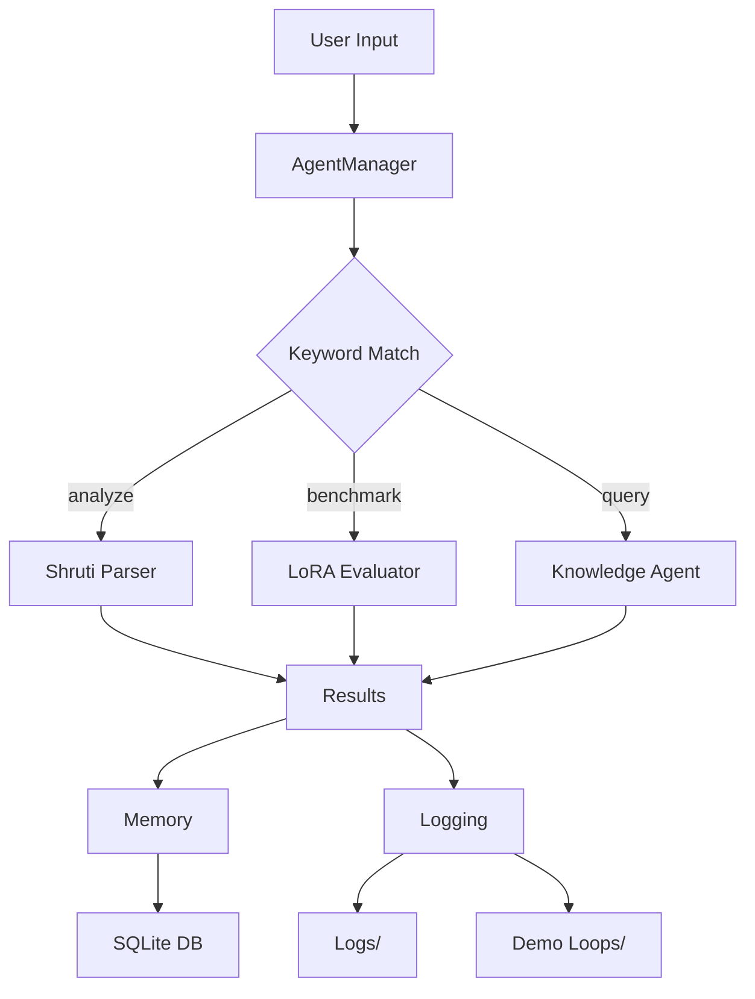

# Architecture

## Overview

Soma-Orchestrator-Core is a modular orchestrator that coordinates multiple AI agents dynamically based on user input.

## Components

- **AgentManager**: Routes input to appropriate agents
- **Agents**: Specialized micro-services
  - Shruti Parser
  - LoRA Evaluator
  - Knowledge Agent
- **Memory**: SQLite-based session storage
- **Logging**: Terminal and file logging

## Flow

## Agent Details

- **Shruti Parser**: Calls external HTTP service for text analysis
- **LoRA Evaluator**: Mocks benchmarking of LoRA models
- **Knowledge Agent**: FAISS-based retrieval from local documents

## Data Flow

1. Input parsed for keywords
2. Agents selected and executed
3. Results collected and logged
4. Session saved to memory and demo files